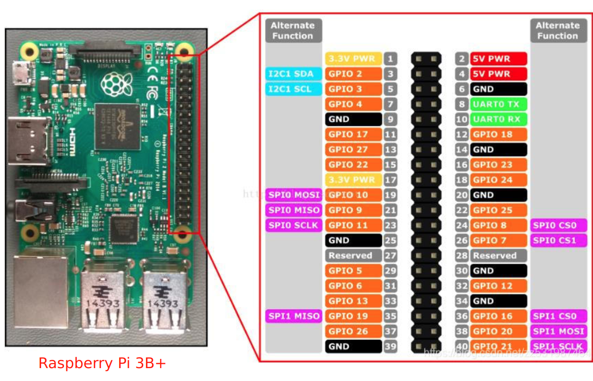
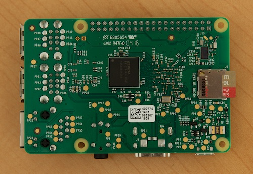
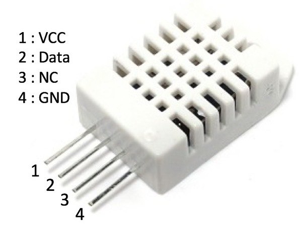
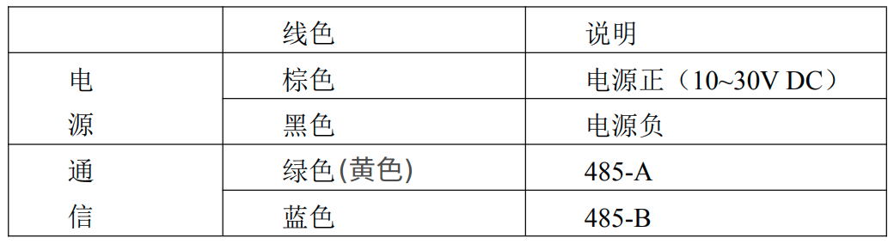

# The Guide for Developing a Data Collection System
##  1. Raspberry Pi
  
__Figure 1.__ The pin diagram of the Raspberry Pi 3B+.  
  
__Figure 2.__ The Raspberry Pi back image (SD card slot).
## 2. Ubuntu-Operation System(OS)
__NOTE 1:__ I have already assisted you in installing the Ubuntu OS, necessary Python packages and starting the SSH server as well as setting the WiFi setup. You can now access the Ubuntu OS directly via __XSHELL__ software.  
- __Ubuntu:__  
    - username = ubuntu      
    - password = ubuntugtiit
- __WiFi:__  
    - username = ubuntu
    - password = 88888888

__NOTE 2:__ Enable the mobile hotspot on your computer and configure the username and password as specified in NOTE 1. You will use the Raspberry Pi's IP address, which you can find here, for SSH remote access.
### 2.1. XSHELL
__Purpose:__ Remote login to the Raspberry Pi Ubuntu OS using the SSH protocol via [XSHELL](https://cdn.netsarang.net/8480c912/Xshell-8.0.0063p.exe) software.  
__HowToUse:__   
- __Step 1:__ Install the XSHELL software on Windows (Alternatively, you can use other SSH software for remote login).  __Omitted!__
- __Step 2:__ *打开XSHELL软件* - *文件* - *新建* - *名称(N): (任意填写)* - *协议(P): (SSH)* - *主机(H): (在电脑热点设置中，查看树莓派IP地址)* - *(端口号(O): 22)*
- __Step 3:__ *点击用户身份验证* - *填写用户名和密码(参考NOTE 1: Ubuntu)* - *点击连接*  
### 2.2. Download Project via Git  
__Git:__ Enter the commands below in the (XSHELL - 本地Shell) interface.  
- cd /  
- cd /usr/local/  
- sudo mkdir project  
- git clone https://github.com/bslbschef/ISEC2024-Final-Project  
- cd ISEC2024-Final-Project
## 3. Hygrothermograph sensor  
### 3.1. DHT22
  
__Figure 3.__ The schematic of [DHT22]((https://www.sparkfun.com/datasheets/Sensors/Temperature/DHT22.pdf)  ) Hygrothermograph Sensor (We only use port 1, 2 and 4).   
__NOTE:__ I have already connected the DuPont wires for you. Just connect them directly to the Raspberry Pi pins!  
__HowToUse:__   
- __Port 1 (VCC):__ Connected to pin 4 (gray) in Figure 1.   
- __Port 2 (Data):__ Connected to pin 12 (gray) in Figure 1.  
- __Port 4 (GND):__ Connected to pin 6 (gray) in Figure 1.  
### 3.2. BMP280   
  
__Figure 4.__ The schematic of [BMP280](https://www.youtube.com/watch?v=xA-vExF6ChI) Pressure Snesor (We only use port VCC, GND, SCL, SDA)  
__NOTE:__ I have already soldered the pins of the BMP280 module and the DuPont wires for you. Just connect them directly to the Raspberry Pi pins!  
__HowToUse:__  
- __Port (VCC):__ Connected to pin 1 (gray) in Figure 1.  
- __Port (GND):__ Connected to pin 9 (gray) in Figure 1.  
- __Port (SCL):__ Connected to pin 5 (gray) in Figure 1.  
- __Port (SDA):__ Connected to pin 3 (gray) in Figure 1.  
### 3.3. Wind Speed Sensor
  
__Figure 5.__ The figure of wind speed sensor ([485型聚碳风速传感器](http://save.ztsiot.com/%E4%BA%A7%E5%93%81%E8%AF%B4%E6%98%8E%E4%B9%A6/ZTS/%E6%B0%94%E8%B1%A1%E5%86%9C%E4%B8%9A/%E5%85%86%E6%B3%B0%E7%9B%9B%E9%93%9D%E5%A3%B3%E9%A3%8E%E9%80%9F%E4%BC%A0%E6%84%9F%E5%99%A8%EF%BC%88485%E5%9E%8B%EF%BC%89.pdf)).    
   
__Figure 6.__ The wiring diagram.  
__NOTE 1:__ Since the sensor is based on the RS485 communication protocol, we need an RS485 to USB converter module. I have already connected this module for you.  
__NOTE 2:__ This sensor requires an external power supply, and you need to use a **12V battery** for power. I have already soldered the necessary connection lines for you. **Please make sure not to reverse the positive and negative terminals!!!**  

__HowToUse:__  
- __NOTE:__ 
### 3.3. Wind Direction Sensor (485型十六方位聚碳风向传感器)  